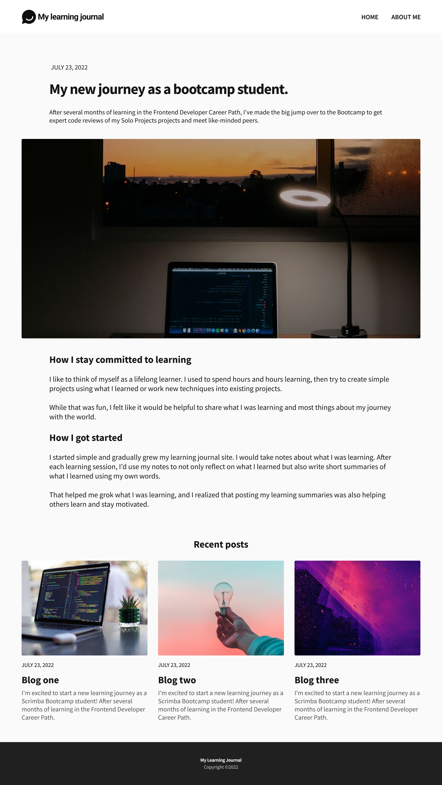
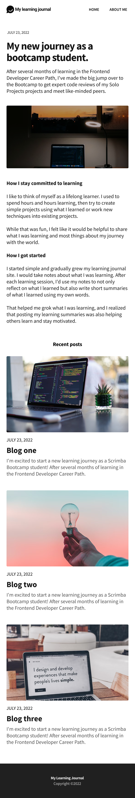

# My Learning Journal

[](https://github.com/)
[](https://github.com/)
[](https://opensource.org/licenses/MIT)

A personal blog documenting my journey as a bootcamp student, sharing what I've learned and how I stay committed to learning.

## Table of Contents

- [About The Project](#about-the-project)
- [Features](#features)
- [Screenshots](#screenshots)
- [Technologies](#technologies)
- [Getting Started](#getting-started)
  - [Prerequisites](#prerequisites)
  - [Installation](#installation)
- [Usage](#usage)
- [Contributing](#contributing)
- [License](#license)
- [Contact](#contact)

## About The Project

This project is a personal learning journal created to document my progress and experiences as a student in a coding bootcamp. It serves as a platform to share insights, reflect on what I've learned, and connect with a community of fellow learners.

## Features

- **Responsive Design:** Fully responsive layout that works on all devices.
- **Accessible and semantic** HTML structure
- **Blog Layout:** Clean and simple blog layout with a main article and recent posts.
- **Dynamic Content:** Easily update content by modifying the HTML.

## Screenshots

*Replace these with your own screenshots.*

**Desktop View**


**Mobile View**


## Technologies

- [HTML5](https://developer.mozilla.org/en-US/docs/Web/Guide/HTML/HTML5)
- [CSS3](https://developer.mozilla.org/en-US/docs/Web/CSS/CSS3)
- [Vite](https://vitejs.dev/)

## Getting Started

To get a local copy up and running follow these simple steps.

### Prerequisites

- [Node.js](https://nodejs.org/en/) installed on your machine.

### Installation

1. Clone the repo
   ```sh
   git clone https://github.com/bakadja/learning-journal.git
   ```
2. Install NPM packages
   ```sh
   npm install
   ```

## Usage

- **Development:**
  ```sh
  npm run dev
  ```
- **Production Build:**
  ```sh
  npm run build
  ```
- **Preview Production Build:**
  ```sh
  npm run preview
  ```

## Contributing

Contributions are what make the open source community such an amazing place to learn, inspire, and create. Any contributions you make are **greatly appreciated**.

1. Fork the Project
2. Create your Feature Branch (`git checkout -b feature/AmazingFeature`)
3. Commit your Changes (`git commit -m '''Add some AmazingFeature'''`)
4. Push to the Branch (`git push origin feature/AmazingFeature`)
5. Open a Pull Request

## License

Distributed under the MIT License. See `LICENSE` for more information.

## Contact

For questions or feedback, please contact [contact@kevinpaulidor.de](mailto:contact@kevinpaulidor.de).

